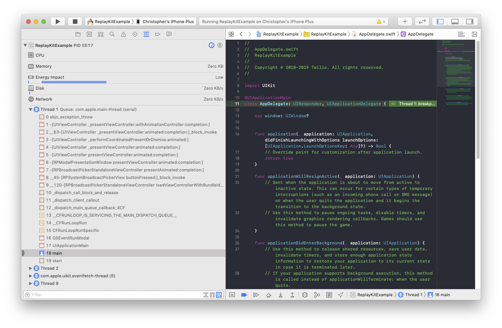
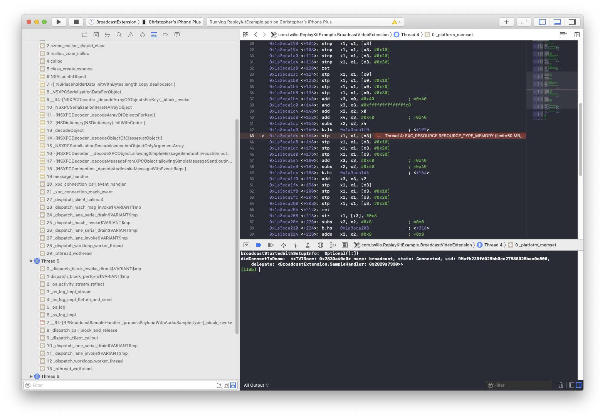

# Twilio Video - iOS 13 Migration Guide

The guide explains how to prepare your Twilio Video apps for compatibility with iOS 13.

## Supported SDKs

We recommend that you use the latest patch releases of our SDKs. At this time, we have verified our [2.10.1](https://www.twilio.com/docs/video/changelog-twilio-video-ios-version-2x#2101-august-16-2019), and [3.0.0-beta4](https://www.twilio.com/docs/video/changelog-twilio-video-ios-version-3x#300-beta4-september-6-2019) SDKs for compatibility with iOS 13.0-beta8 and 13.1-beta2.

## Known Issues

We are tracking several issues related to both the Video SDK itself and the [example code](https://github.com/twilio/video-quickstart-ios).

### SDK

1. **Catalyst Support**

Twilio Video does not support Catalyst applications at this time. If you are interested in this feature please let us know in [#49](https://github.com/twilio/twilio-video-ios/issues/49).

2. **TVICameraSource - Background Task Completion Errors**

When `TVICameraSource` starts capturing it begins a background task to ensure that the video pipeline is flushed in the case of an interruption. In iOS 13.0, ending background tasks might send spurious logs to the console:

> 2019-09-03 13:44:15.345 VideoCallKitQuickStart[983:48546] Video track created
> 
> // After backgrounding the application
> 
> 2019-09-03 13:44:21.979 VideoCallKitQuickStart[983:48546] Can't end BackgroundTask: no background task exists with identifier 3 (0x3), or it may have already been ended. Break in UIApplicationEndBackgroundTaskError() to debug.

**Status:** We have given feedback to Apple, and hope that this issue can be resolved during the iOS 13 release cycle.

3. **TVICameraSource - Distorted video after device usage interruption**

See issue [#53](https://github.com/twilio/twilio-video-ios/issues/53). 

**Status:** We are still investigating this report and may issue patch releases of our SDK to address it.

4. **TVIVideoView - OpenGL ES crashes on iOS Simulator**

The SDK will crash when rendering decoded H.264 video, or any other frames in the `TVIPixelFormatYUV420BiPlanarVideoRange` or `TVIPixelFormatYUV420BiPlanarFullRange` formats when using the iOS 13.0 simulator.

**Resolution:** Update Twilio Video to [3.0.0-beta4](https://www.twilio.com/docs/video/changelog-twilio-video-ios-version-3x#300-beta4-september-6-2019), or 2.10.2 (coming soon). Use an older simulator model for testing if your deployment target is earlier than 13.0.

5. **TVIVideoView - Metal on the iOS Simulator**

At the moment, Twilio Video does not support Metal on the iOS 13.0 simulator.

**Status:** We will provide an update once iOS 13.0 and macOS 10.15 are released.

6. **UIScene & UIApplication Lifecycle**

iOS 13 introduces new UIScene APIs to better manage navigation hierarchy and lifecycle events. Twilio Video has several classes that register for UIApplication lifecycle notifications, and continue to do so in iOS 13:

- TVIVideoView
- TVICameraSource
- TVICameraCapturer (2.x only)
- TVIRoom (2.x only)

**Status:** We are currently investigating the impact of UIScene, and compatibility with Twilio Video classes.

7. **Swift UI**

**Status:** We are still evaluating Swift UI on iOS 13. Integrators should note that `TVIVideoView` does not specify an `intrinsicContentSize`.

8. **iPadOS**

iPadOS 13.0 will be released on September 30th and offers a brand new multi-tasking user interface.

**Status:** We are still evaluating compatibility with iPadOS 13 and expect to provide an update soon.

### Sample Code & Framework Integrations

1. **CallKit**

Starting a `TVIDefaultAudioDevice` [might fail](https://forums.developer.apple.com/thread/120038) when the Participant’s device reports an incoming call to CallKit while backgrounded in iOS 12.4 or 13.0-beta8.

**Status:** This issue should be resolved in iOS 13.1. We will retest with the latest beta release to confirm.

2. **ReplayKit**

The [ReplayKit Framework](https://developer.apple.com/documentation/replaykit) received some significant enhancements in iOS 13, resolving problems with delayed application audio and the reliability of `RPScreenRecorder`. However, there is also a [serious bug](https://stackoverflow.com/questions/57163212/get-nsinvalidargumentexception-when-trying-to-present-rpsystembroadcastpickervie) in iOS 13.0-beta8 (fixed in 13.1-beta2) that can cause a crash when using [RPSystemBroadcastPickerView](https://developer.apple.com/documentation/replaykit/rpsystembroadcastpickerview?language=objc).



If you use a broadcast extension in iOS 13.0-beta8 there is also a memory leak that will result in a crash when the microphone is enabled. This crash is resolved in iOS 13.1-beta2.



If you use `ExampleReplayKitAudioCapturer` to capture application audio samples, then you may experience distortion on iOS 13.0 due to changes in the audio format used by ReplayKit.

**Resolution:** Refer to the updated example app ([master](https://github.com/twilio/video-quickstart-ios/tree/master/ReplayKitExample), [3.0.0-beta](https://github.com/twilio/video-quickstart-ios/tree/3.0.0-beta/ReplayKitExample)) for iOS 13 support. Consider disabling `RPBroadcastSystemPickerView` on iOS 13.0 using a runtime check until iOS 13.1 is available.

3. **Swift Naming Conflicts (3.0.0-beta)**

When compiling the [3.0.0-beta examples](https://github.com/twilio/video-quickstart-ios/tree/3.0.0-beta/), the Objective-C class `TVIAudioCodec` conflicts with the `AudioCodec` type definition from AudioToolbox.framework when compiled with Xcode 11.

**Resolution:** The [examples](https://github.com/twilio/video-quickstart-ios/tree/3.0.0-beta/) were updated to eliminate the conflict. If you are experiencing conflicts with the Swift translation of Twilio Video classes, then refer to the classes using their fully qualified name:

```.swift
// Both frameworks define the Swift name AudioCodec
import AudioToolbox
import TwilioVideo

// Specify the Twilio class by its full name
var audioCodec: TwilioVideo.AudioCodec?
```

## Feedback

If you have questions about iOS 13 get in touch with us on the linked issues or file a new issue in the [twilio-video-ios](https://github.com/twilio/twilio-video-ios/issues) or [video-quickstart-ios](https://github.com/twilio/video-quickstart-ios/issues) repositories.
